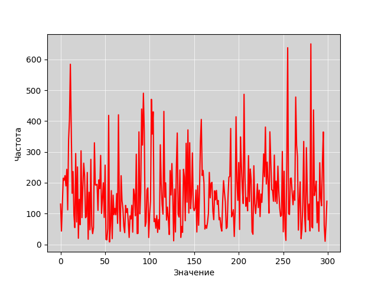

# Учебно-исследовательская работа 1 (УИР 1) «Обработка результатов измерений: статистический анализ числовой последовательности»

## **Цель работы**

Изучение методов обработки и статистического анализа результатов
измерений на примере заданной числовой последовательности путем оценки
числовых моментов и выявления свойств последовательности на основе
корреляционного анализа, а также аппроксимация закона распределения заданной
последовательности по двум числовым моментам случайной величины.

## **Порядок выполнения работы**

В процессе исследований необходимо выполнить обработку заданной
числовой последовательности (ЧП) для случаев, когда путем измерений получено
10, 20, 50, 100, 200 и 300 значений случайной величины, а именно:

- **рассчитать значения** следующих числовых моментов заданной числовой
последовательности:
  - *математическое ожидание*;
  - *дисперсию*;
  - *среднеквадратичное отклонение*;
  - *коэффициент вариации*;
  - *доверительные интервалы* для оценки математического ожидания с *доверительными вероятностями 0,9; 0,95 и 0,99;*
  - *относительные отклонения* (в процентах) полученных значений от наилучших значений, полагая, что наилучшими (*эталонными*) являются значения, рассчитанные для наиболее представительной выборки из трехсот случайных величин;
- построить **график значений** для заданной числовой последовательности и
определить ее характер, а именно: является эта последовательность
*возрастающей/убывающей*, *периодичной* (при наличии периодичности
оценить по графику длину периода);
- выполнить **автокорреляционный анализ** и определить, можно ли
заданную числовую последовательность считать случайной;
- построить **гистограмму распределения частот** для заданной числовой
последовательности;
- выполнить **аппроксимацию закона распределения** заданной случайной
последовательности по двум начальным моментам, используя, в
зависимости от значения коэффициента вариации, одно из следующих
распределений:
  - равномерный;
  - экспоненциальный;
  - нормированный Эрланга k-го порядка или гипоэкспоненциальный с
заданным коэффициентом вариации;
  - гиперэкспоненциальный с заданным коэффициентом вариации;
- реализовать генератор случайных величин в соответствии с полученным
аппроксимирующим законом распределения и
**проиллюстрировать на защите** его работу;
- сгенерировать последовательность случайных величин в соответствии с
полученным законом распределения и рассчитать значения числовых
моментов по аналогии с заданной числовой последовательностью;
- выполнить *автокорреляционный анализ* сгенерированной
последовательности случайных величин; 
- выполнить сравнительный анализ *сгенерированной* последовательности
случайных величин с *заданной* последовательностью, построив
соответствующие зависимости на **графике значений и гистограмме
распределения частот;**
- оценить корреляционную зависимость *сгенерированной* и *заданной*
последовательностей случайных величин.

Результаты проводимых исследований представить в виде таблиц и графиков.

На основе полученных промежуточных и конечных результатов следует
сделать **обоснованные выводы** об исследуемой числовой последовательности,
предложить **закон распределения** для ее описания и **оценить качество
аппроксимации** этим законом.

### Характеристики  ***заданной*** ЧП (**вариант 2**)

<table>
  <thead>
    <tr>
      <th rowspan="2">Характеристика</th>
      <th colspan="7">Количество случайных величин</th>
    </tr>
    <tr>
    <th></th>
    <th>10</th>
    <th>20</th>
    <th>50</th>
    <th>100</th>
    <th>200</th>
    <th>300</th>
    </tr>
  </thead>
  <tbody>
    <tr>
      <td rowspan="2"><b>Мат. ож.</b></td>
      <td>Знач</td>
      <td>147.844</td>
      <td>181.747</td>
      <td>146.786</td>
      <td>165.879</td>
      <td>173.955</td>
      <td rowspan="2">168.836</td>
    </tr>
        <tr>
      <td>%</td>
      <td>12.433</td>
      <td>7.647</td>
      <td>13.06</td>
      <td>1.751</td>
      <td>3.032</td>
    </tr>
    <tr>
      <td rowspan="2">Дов. инт. (0,9)</td>
      <td>Знач</td>
      <td>30.879</td>
      <td>46.27</td>
      <td>21.414</td>
      <td>16.096</td>
      <td>13.063</td>
      <td rowspan="2">11.039</td>
    </tr>
    <tr>
      <td>%</td>
      <td>179.712</td>
      <td>319.132</td>
      <td>93.982</td>
      <td>45.807</td>
      <td>18.332</td>
    </tr>
        <tr>
      <td rowspan="2">Дов. инт. (0,95)</td>
      <td>Знач</td>
      <td>36.836</td>
      <td>55.197</td>
      <td>25.546</td>
      <td>19.202</td>
      <td>15.584</td>
      <td rowspan="2">13.169</td>
    </tr>
    <tr>
      <td>%</td>
      <td>179.712</td>
      <td>319.132</td>
      <td>93.982</td>
      <td>45.807</td>
      <td>18.332</td>
    </tr>
        <tr>
      <td rowspan="2">Дов. инт. (0,99)</td>
      <td>Знач</td>
      <td>48.413</td>
      <td>72.545</td>
      <td>33.575</td>
      <td>25.237</td>
      <td>20.481</td>
      <td rowspan="2">17.308</td>
    </tr>
    <tr>
      <td>%</td>
      <td>179.712</td>
      <td>319.132</td>
      <td>93.982</td>
      <td>45.807</td>
      <td>18.332</td>
    </tr>
        <tr>
      <td rowspan="2"><b>Дисперсия</b></td>
      <td>Знач</td>
      <td>3532.136</td>
      <td>15861.648</td>
      <td>8493.935</td>
      <td>9597.771</td>
      <td>12643.022</td>
      <td rowspan="2">13543.708</td>
    </tr>
    <tr>
      <td>%</td>
      <td>73.92</td>
      <td>17.115</td>
      <td>37.285</td>
      <td>29.135</td>
      <td>6.65</td>
    </tr>
            <tr>
      <td rowspan="2"><b>С.к.о.</b></td>
      <td>Знач</td>
      <td>59.432</td>
      <td>125.943</td>
      <td>92.163</td>
      <td>97.968</td>
      <td>112.441</td>
      <td rowspan="2">116.377</td>
    </tr>
    <tr>
      <td>%</td>
      <td>48.932</td>
      <td>8.219</td>
      <td>20.807</td>
      <td>15.819</td>
      <td>3.382</td>
    </tr>
            <tr>
      <td rowspan="2"><b>К-т вариации</b></td>
      <td>Знач</td>
      <td>0.402</td>
      <td>0.693</td>
      <td>0.628</td>
      <td>0.591</td>
      <td>0.646</td>
      <td rowspan="2">0.689</td>
    </tr>
    <tr>
      <td>%</td>
      <td>41.681</td>
      <td>0.532</td>
      <td>8.911</td>
      <td>14.318</td>
      <td>6.226</td>
    </tr>
  </tbody>
</table>

% - относительные отклонения рассчитанных значений от значений, полученных для выборки из трехсот величин 

### График значений заданной ЧП

\#TODO ВЫВОДЫ ПО ГРАФИКУ

### Характеристики  ***сгенерированной*** случайной ЧП

<table>
  <thead>
    <tr>
      <th colspan="9"><b><i>Закон распределения: Эрланга 2-го порядка</i></b></th>
    </tr>
    <tr>
      <th rowspan="2">Характеристика</th>
      <th colspan="7">Количество случайных величин</th>
    </tr>
    <tr>
    <th></th>
    <th>10</th>
    <th>20</th>
    <th>50</th>
    <th>100</th>
    <th>200</th>
    <th>300</th>
    </tr>
  </thead>
  <tbody>
    <tr>
      <td rowspan="2"><b>Мат. ож.</b></td>
      <td>Знач</td>
      <td>147.212</td>
      <td>174.79</td>
      <td>140.334</td>
      <td>150.551</td>
      <td>149.401</td>
      <td rowspan="2">167.509</td>
    </tr>
        <tr>
      <td>%</td>
      <td>0.428</td>
      <td>3.828</td>
      <td>4.396</td>
      <td>9.24</td>
      <td>14.115</td>
    </tr>
    <tr>
      <td rowspan="2">Дов. инт. (0,9)</td>
      <td>Знач</td>
      <td>56.297</td>
      <td>32.358</td>
      <td>26.955</td>
      <td>18.398</td>
      <td>12.405</td>
      <td rowspan="2">11.129</td>
    </tr>
    <tr>
      <td>%</td>
      <td>82.314</td>
      <td>30.067</td>
      <td>25.878</td>
      <td>14.302</td>
      <td>5.036</td>
    </tr>
        <tr>
      <td rowspan="2">Дов. инт. (0,95)</td>
      <td>Знач</td>
      <td>67.159</td>
      <td>38.601</td>
      <td>32.156</td>
      <td>21.948</td>
      <td>14.799</td>
      <td rowspan="2">13.276</td>
    </tr>
    <tr>
      <td>%</td>
      <td>82.314</td>
      <td>30.067</td>
      <td>25.878</td>
      <td>14.302</td>
      <td>5.036</td>
    </tr>
    <tr>
      <td rowspan="2">Дов. инт. (0,99)</td>
      <td>Знач</td>
      <td>88.265</td>
      <td>50.733</td>
      <td>42.262</td>
      <td>28.846</td>
      <td>19.45</td>
      <td rowspan="2">17.448</td>
    </tr>
    <tr>
      <td>%</td>
      <td>82.314</td>
      <td>30.067</td>
      <td>25.878</td>
      <td>14.302</td>
      <td>5.036</td>
    </tr>
    <tr>
      <td rowspan="2"><b>Дисперсия</b></td>
      <td>Знач</td>
      <td>11740.59</td>
      <td>7757.336</td>
      <td>13458.226</td>
      <td>12539.109</td>
      <td>11401.489</td>
      <td rowspan="2">13763.211</td>
    </tr>
    <tr>
      <td>%</td>
      <td>232.393</td>
      <td>51.094</td>
      <td>58.445</td>
      <td>30.646</td>
      <td>9.82</td>
    </tr>
    <tr>
      <td rowspan="2"><b>С.к.о.</b></td>
      <td>Знач</td>
      <td>108.354</td>
      <td>88.076</td>
      <td>116.01</td>
      <td>111.978</td>
      <td>106.778</td>
      <td rowspan="2">117.317</td>
    </tr>
    <tr>
      <td>%</td>
      <td>82.316</td>
      <td>30.067</td>
      <td>25.874</td>
      <td>14.301</td>
      <td>5.037</td>
    </tr>
    <tr>
      <td rowspan="2"><b>К-т вариации</b></td>
      <td>Знач</td>
      <td>0.736</td>
      <td>0.504</td>
      <td>0.827</td>
      <td>0.744</td>
      <td>0.715</td>
      <td rowspan="2">0.7</td>
    </tr>
    <tr>
      <td>%</td>
      <td>83.095</td>
      <td>27.288</td>
      <td>31.635</td>
      <td>25.853</td>
      <td>10.635</td>
    </tr>
  </tbody>
</table>

% - относительные отклонения характеристик <b>сгенерированной</b> случайной
последовательности от одноименных значений <b>заданной</b> числовой
последовательности

### Коэффициенты автокорреляции

<table>
<thead>
<tr>
<th><b>Сдвиг ЧП</b></th>
<th>1</th>
<th>2</th>
<th>3</th>
<th>4</th>
<th>5</th>
<th>6</th>
<th>7</th>
<th>8</th>
<th>9</th>
<th>10</th>
</tr>
</thead>
<tr>
<td><b>К-т</b> АК для задан. <b>ЧП</b></td>
<td>-</td>
<td>-</td>
<td>-</td>
<td>-</td>
<td>-</td>
<td>-</td>
<td>-</td>
<td>-</td>
<td>-</td>
<td>-</td>
</tr>
<tr>
<td><b>К-т</b> АК для сгенер. <b>ЧП</b></td>
<td>-</td>
<td>-</td>
<td>-</td>
<td>-</td>
<td>-</td>
<td>-</td>
<td>-</td>
<td>-</td>
<td>-</td>
<td>-</td>
</tr>
<tr>
<td><b>%</b></td>
<td>-</td>
<td>-</td>
<td>-</td>
<td>-</td>
<td>-</td>
<td>-</td>
<td>-</td>
<td>-</td>
<td>-</td>
<td>-</td>
</tr>
</table>

## \#TODO Вставить графики гистограмм распределения частот для заданной и сгенерированной ЧП

## \#TODO мб сделать покрасивее графики

## \#TODO сделать автокорреляцию, выводы по ней
