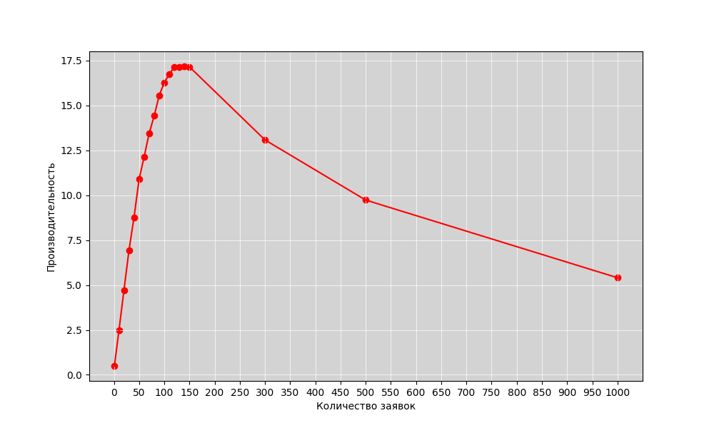
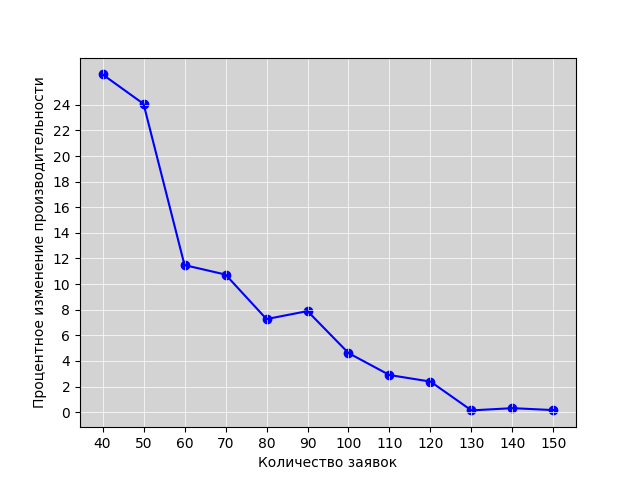
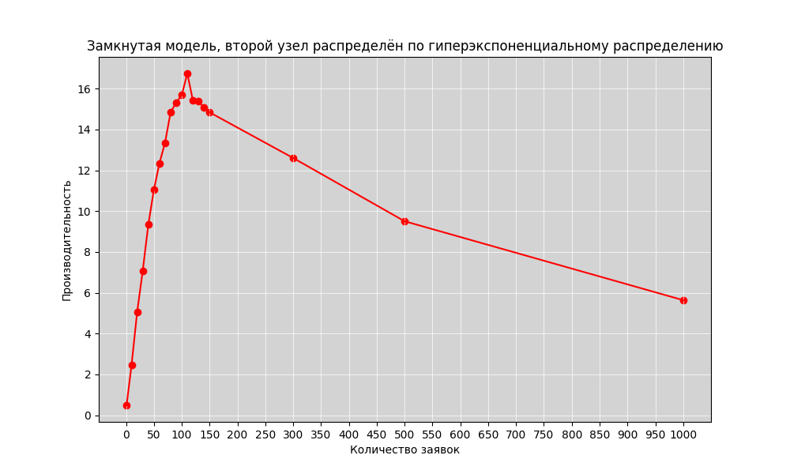
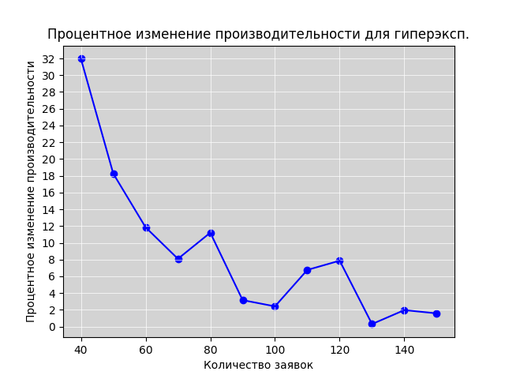

## Министерство науки и высшего образования Российской Федерации
## Федеральное государственное автономное образовательное учреждение высшего образования
## «Национальный исследовательский университет ИТМО»
## Факультет программной инженерии и компьютерной техники
**Отчёт по лабораторной работе №4**

по дисциплине
"Моделирование"

<b>Выполнили студенты группы P3312:</b>

Кобелев Роман Павлович;
Балин Артем Алексеевич;
Дениченко Александр Олегович

<b>Преподаватель:</b>
Мартынчук Илья Геннадьевич

г. Санкт-Петербург

2024г.

## Начальные условия

Кол-во узлов: 3

Количество приборов в узлах: 3, 1, 1

Номер особенного узла с ____ распределением 2

`p10` = 0.2

`p12` = 0.4

`p21` = 1

`p31` = 1

`p13` = 0.4

### Среднее время обслуживания:

`b1` = 2

`b2` = 5.5

`b3` = 10

## 4.1

### [Замкнутая модель, второй узел распределён по эрлангу](./наша%20модель%20Замкнутая%20Эрланг.gps)

Как мы видим, критическая точка достигается при $M \in [130, 150]$

### [Замкнутая модель, второй узел распределён по гиперэксп.](./наша%20модель%20Замкнутая%20Гипер.gps)

Как мы видим, критическая точка достигается при $M = 130$

## 4.2

Далее мы изменяли значение `b` так, чтобы загрузка в каждом узле была равна `1`

### [Замкнутая модель, второй узел распределён по эрлангу](./наша%20модель%20Замкнутая%20Эрланг.gps)

| M | $b_1$ | $b_2$ | $b_3$ | $p_1$ | $p_2$ | $p_3$ |
|------|-----|-----|-----|-----|-----|-----|
| 1 | 2.0 | 5.5 | 10.0 | 0.247 | 0.090 | 0.482 |
| 5 | 2.0 | 5.5 | 10.0 | 0.485 | 0.177 | 0.971 |
| 7 | 2.0 | 5.5 | 10.0 | 0.495 | 0.181 | 0.993 |
| 7 | 2.0 | 5.5 | 9.5 | 0.520 | 0.189 | 0.991 |
| 7 | 2.0 | 5.5 | 5.5 | 0.809 | 0.296 | 0.893 |
| 14 | 2.0 | 5.5 | 5.5 | 0.873 | 0.319 | 0.965 |
| 34 | 2.0 | 5.5 | 5.5 | 0.905 | 0.330 | 0.996 |
| 68 | 2.0 | 5.5 | 5.5 | 0.909 | 0.332 | 0.999 |
| 68 | 2.0 | 5.5 | 4.5 | 1.000 | 0.366 | 0.905 |
| 68 | 1.8 | 5.5 | 4.5 | 0.983 | 0.401 | 0.989 |
| 136 | 1.8 | 5.5 | 4.5 | 0.990 | 0.404 | 0.993 |
| 272 | 1.8 | 5.5 | 4.5 | 0.996 | 0.404 | 0.993 |
| 544 | 1.8 | 5.5 | 4.5 | 1.000 | 0.408 | 0.993 |
| 544 | 1.77 | 5.5 | 4.5 | 0.997 | 0.408 | 0.998 |
| 1088 | 1.77 | 5.5 | 4.5 | 1.000 | 0.415 | 0.998 |
| 1088 | 1.725 | 5.5 | 4.5 | 0.998 | 0.426 | 0.999 |
| 2176 | 1.725 | 5.5 | 4.5 | 1.000 | 0.427 | 0.999 |
| 2176 | 1.6 | 5.5 | 4.5 | 1.000 | 0.427 | 0.999 |
| 2176 | 1.652 | 5.5 | 4.5 | 0.999 | 0.447 | 0.999 |
| 4352 | 1.652 | 5.5 | 4.5 | 1.000 | 0.447 | 0.999 |
| 4352 | 1.515 | 5.5 | 4.5 | 0.999 | 0.487 | 0.999 |
| 8704 | 1.515 | 5.5 | 4.5 | 1.000 | 0.487 | 0.999 |
| 8704 | 1.2 | 5.5 | 4.0 | 1.000 | 0.615 | 1.000 |
| 17408 | 1.0 | 5.5 | 3.5 | 1.000 | 0.738 | 1.000 |
| 17408 | 0.8 | 5.5 | 2.5 | 1.000 | 0.921 | 1.000 |
| 17408 | 0.75 | 5.5 | 2.4 | 1.000 | 0.982 | 1.000 |
| 17408 | 0.75 | 5.5 | 2.4 | 1.000 | 0.982 | 1.000 |
| 34816 | 0.72 | 5.5 | 2.4 | 1.000 | 1.000 | 1.000 |

### [Замкнутая модель, второй узел распределён по гиперэксп.](./наша%20модель%20Замкнутая%20Гипер.gps)

| M | b1 | b3 | p1 | p2 | p3 |
|------|-----|-----|-----|-----|-----|
| 1 | 2.0 | 10.0 | 0.245 | 0.088 | 0.492 |
| 4 | 2.0 | 10.0 | 0.464 | 0.170 | 0.943 |
| 8 | 2.0 | 10.0 | 0.491 | 0.182 | 0.997 |
| 16 | 2.0 | 10.0 | 0.491 | 0.182 | 1.000 |
| 16 | 2.0 | 5.0 | 0.932 | 0.340 | 0.941 |
| 32 | 2.0 | 5.0 | 0.963 | 0.352 | 0.976 |
| 64 | 2.0 | 5.0 | 0.983 | 0.362 | 0.993 |
| 128 | 2.0 | 5.0 | 0.989 | 0.367 | 0.998 |
| 256 | 2.0 | 5.0 | 0.996 | 0.362 | 0.998 |
| 512 | 2.0 | 5.0 | 1.000 | 0.364 | 0.998 |
| 512 | 1.975 | 5.0 | 0.997 | 0.373 | 0.998 |
| 1024 | 1.975 | 5.0 | 1.000 | 0.375 | 0.998 |
| 1024 | 1.95 | 5.0 | 0.999 | 0.383 | 0.999 |
| 2048 | 1.932 | 5.0 | 1.000 | 0.382 | 0.999 |
| 4096 | 1.932 | 5.0 | 1.000 | 0.382 | 0.999 |
| 4096 | 1.6 | 5.0 | 0.955 | 0.444 | 1.000 |
| 4096 | 1.6 | 4.5 | 1.000 | 0.465 | 0.999 |
| 8192 | 1.6 | 4.5 | 1.000 | 0.465 | 0.999 |
| 16384 | 1.5 | 4.5 | 1.000 | 0.492 | 1.000 |
| 16384 | 1.3 | 3.9 | 1.000 | 0.569 | 1.000 |
| 16384 | 1.0 | 3.0 | 1.000 | 0.745 | 1.000 |
| 16384 | 0.8 | 2.4 | 1.000 | 0.923 | 1.000 |
| 16384 | 0.8 | 2.4 | 1.000 | 0.923 | 1.000 |
| 16384 | 0.7 | 2.1 | 1.000 | 1.000 | 1.000 |

### РСеМо

done
[РЕЗЫ](./4.3.txt)

вы сделали предыдущие пункты до пункта 4.3, у вас есть данные об производительности ЗСеМо

теперь у вас есть аналогичные файлики с другим названием, где уже написан код для самой РСеМо, но вам необходимо в значение `t_a` поставить значение производительности из пред. пунктов

### для пункта 4.4 и первого подпункта

done
[РЕЗЫ](./4.4.1.txt)

>оценить влияние закона распределения (коэффициента вариации)
длительности обслуживания заявок в заданном узле на
характеристики функционирования сети

сравниваете 3 файла Замкнутых

### для 4.4 второй подпункт

done
[РЕЗЫ](./4.4.2.txt)

>выполнить анализ влияния количества заявок в замкнутой сети с
неэкспоненциальным распределением длительности обслуживания
заявок в заданном узле на характеристики функционирования и
сравнить с аналогичными характеристиками замкнутой сети с
экспоненциальным распределением длительности обслуживания
заявок в том же узле

ключевые слова: `количества заявок`, файлики те же 3

по сути в предыдущем мы делали общие характеристики, а тут нужно прям количество заявок поисследовать, поуменьшать их и поувеличивать

### 4.5

#### Первый подпункт

done
[РЕЗЫ](./4.5.1.txt)

сравнить разомкнутые и замкнутые, то есть эрланг с эрлангом и гипер с гипер

#### Второй подпункт

done
[РЕЗЫ](./4.5.2.txt)

сравнить [Эрланг простейший](./наша%20модель%20Разомкнутая%20Эрланг.gps) и [Эрланг детерменированный](./Разомкнутая%20Эрланг%20ДЛЯ%204.5%20ДЕТЕРМЕНИРОВАННАЯ.gps)

и там, и там можно менять t_a, чтобы менять интенсивность входящего потока

## 5

графиков многа
