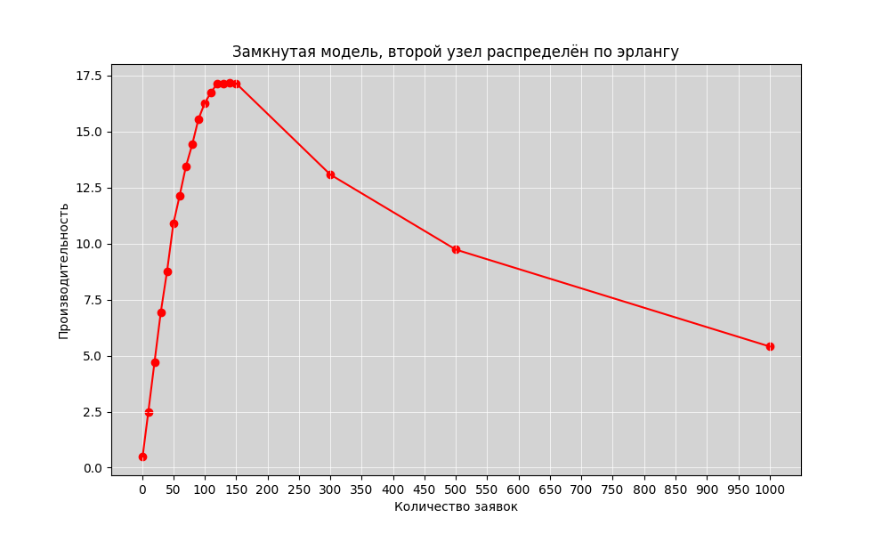

## Министерство науки и высшего образования Российской Федерации
## Федеральное государственное автономное образовательное учреждение высшего образования
## «Национальный исследовательский университет ИТМО»
## Факультет программной инженерии и компьютерной техники
**Отчёт по лабораторной работе №4**

по дисциплине
"Моделирование"

<b>Выполнили студенты группы P3312:</b>

Кобелев Роман Павлович;
Балин Артем Алексеевич;
Дениченко Александр Олегович

<b>Преподаватель:</b>
Мартынчук Илья Геннадьевич

г. Санкт-Петербург

2024г.

## Начальные условия

Кол-во узлов: 3

Количество приборов в узлах: 3, 1, 1

Номер особенного узла с ____ распределением 2

`p10` = 0.2

`p12` = 0.4

`p21` = 1

`p31` = 1

`p13` = 0.4

### Среднее время обслуживания:

`b1` = 2

`b2` = 5.5

`b3` = 10

## 4.1

### [Замкнутая модель, второй узел распределён по эрлангу](./наша%20модель%20Замкнутая%20Эрланг.gps)

Как мы видим, критическая точка достигается при $M \in [130, 150]$

### [Замкнутая модель, второй узел распределён по гиперэксп.](./наша%20модель%20Замкнутая%20Гипер.gps)

Как мы видим, критическая точка достигается при $M = 130$

## 4.2

Далее мы изменяли значение `b` так, чтобы загрузка в каждом узле была равна `1`

### [Замкнутая модель, второй узел распределён по эрлангу](./наша%20модель%20Замкнутая%20Эрланг.gps)

| M | b1 | b2 | b3 | p1 | p2 | p3 |
|------|-----|-----|-----|-----|-----|-----|
| 1 | 2.0 | 5.5 | 10.0 | 0.247 | 0.090 | 0.482 |
| 5 | 2.0 | 5.5 | 10.0 | 0.485 | 0.177 | 0.971 |
| 7 | 2.0 | 5.5 | 10.0 | 0.495 | 0.181 | 0.993 |
| 7 | 2.0 | 5.5 | 9.5 | 0.520 | 0.189 | 0.991 |
| 7 | 2.0 | 5.5 | 5.5 | 0.809 | 0.296 | 0.893 |
| 14 | 2.0 | 5.5 | 5.5 | 0.873 | 0.319 | 0.965 |
| 34 | 2.0 | 5.5 | 5.5 | 0.905 | 0.330 | 0.996 |
| 68 | 2.0 | 5.5 | 5.5 | 0.909 | 0.332 | 0.999 |
| 68 | 2.0 | 5.5 | 4.5 | 1.000 | 0.366 | 0.905 |
| 68 | 1.8 | 5.5 | 4.5 | 0.983 | 0.401 | 0.989 |
| 136 | 1.8 | 5.5 | 4.5 | 0.990 | 0.404 | 0.993 |
| 272 | 1.8 | 5.5 | 4.5 | 0.996 | 0.404 | 0.993 |
| 544 | 1.8 | 5.5 | 4.5 | 1.000 | 0.408 | 0.993 |
| 544 | 1.77 | 5.5 | 4.5 | 0.997 | 0.408 | 0.998 |
| 1088 | 1.77 | 5.5 | 4.5 | 1.000 | 0.415 | 0.998 |
| 1088 | 1.725 | 5.5 | 4.5 | 0.998 | 0.426 | 0.999 |
| 2176 | 1.725 | 5.5 | 4.5 | 1.000 | 0.427 | 0.999 |
| 2176 | 1.6 | 5.5 | 4.5 | 1.000 | 0.427 | 0.999 |
| 2176 | 1.652 | 5.5 | 4.5 | 0.999 | 0.447 | 0.999 |
| 4352 | 1.652 | 5.5 | 4.5 | 1.000 | 0.447 | 0.999 |
| 4352 | 1.515 | 5.5 | 4.5 | 0.999 | 0.487 | 0.999 |
| 8704 | 1.515 | 5.5 | 4.5 | 1.000 | 0.487 | 0.999 |
| 8704 | 1.2 | 5.5 | 4.0 | 1.000 | 0.615 | 1.000 |
| 17408 | 1.0 | 5.5 | 3.5 | 1.000 | 0.738 | 1.000 |
| 17408 | 0.8 | 5.5 | 2.5 | 1.000 | 0.921 | 1.000 |
| 17408 | 0.75 | 5.5 | 2.4 | 1.000 | 0.982 | 1.000 |
| 17408 | 0.75 | 5.5 | 2.4 | 1.000 | 0.982 | 1.000 |
| 34816 | 0.72 | 5.5 | 2.4 | 1.000 | 1.000 | 1.000 |

### [Замкнутая модель, второй узел распределён по гиперэксп.](./наша%20модель%20Замкнутая%20Гипер.gps)

| M | b1 | b3 | p1 | p2 | p3 |
|------|-----|-----|-----|-----|-----|
| 1 | 2.0 | 10.0 | 0.245 | 0.088 | 0.492 |
| 4 | 2.0 | 10.0 | 0.464 | 0.170 | 0.943 |
| 8 | 2.0 | 10.0 | 0.491 | 0.182 | 0.997 |
| 16 | 2.0 | 10.0 | 0.491 | 0.182 | 1.000 |
| 16 | 2.0 | 5.0 | 0.932 | 0.340 | 0.941 |
| 32 | 2.0 | 5.0 | 0.963 | 0.352 | 0.976 |
| 64 | 2.0 | 5.0 | 0.983 | 0.362 | 0.993 |
| 128 | 2.0 | 5.0 | 0.989 | 0.367 | 0.998 |
| 256 | 2.0 | 5.0 | 0.996 | 0.362 | 0.998 |
| 512 | 2.0 | 5.0 | 1.000 | 0.364 | 0.998 |
| 512 | 1.975 | 5.0 | 0.997 | 0.373 | 0.998 |
| 1024 | 1.975 | 5.0 | 1.000 | 0.375 | 0.998 |
| 1024 | 1.95 | 5.0 | 0.999 | 0.383 | 0.999 |
| 2048 | 1.932 | 5.0 | 1.000 | 0.382 | 0.999 |
| 4096 | 1.932 | 5.0 | 1.000 | 0.382 | 0.999 |
| 4096 | 1.6 | 5.0 | 0.955 | 0.444 | 1.000 |
| 4096 | 1.6 | 4.5 | 1.000 | 0.465 | 0.999 |
| 8192 | 1.6 | 4.5 | 1.000 | 0.465 | 0.999 |
| 16384 | 1.5 | 4.5 | 1.000 | 0.492 | 1.000 |
| 16384 | 1.3 | 3.9 | 1.000 | 0.569 | 1.000 |
| 16384 | 1.0 | 3.0 | 1.000 | 0.745 | 1.000 |
| 16384 | 0.8 | 2.4 | 1.000 | 0.923 | 1.000 |
| 16384 | 0.8 | 2.4 | 1.000 | 0.923 | 1.000 |
| 16384 | 0.7 | 2.1 | 1.000 | 1.000 | 1.000 |

## 4.3

Сначала сравним ЗСеМО с РСеМО (которая была получена путём преобразования из ЗСеМО)

Нагруженная РСеМО имеет предельную интенсивность поступления заявок, а также загрузка "узкого места" равна `0.8 - 0.95`

### [Замкнутая модель, второй узел распределён по эрлангу](./наша%20модель%20Замкнутая%20Эрланг.gps)

Моделирование происходило для 14 заявок

| Параметр | ЗСеМО | РСеМО | РСеМО (нагруженная) |
|----------|--------|--------|-------------------|
| Интенсивность поступления | 0.802 | 0.802 | 23.0 |
| b1 | 2.0 | 2.0 | 2.0 |
| b2 | 5.5 | 5.5 | 5.5 |
| b3 | 5.5 | 5.5 | 5.5 |
| Время пребывания | 11.239 ± 8.742 | 34561.551 ± 19901.643 | 3.572 ± 3.669 |
| Загрузка 1 | 0.873 | 1.000 | 0.434 |
| Загрузка 2 | 0.319 | 0.366 | 0.159 |
| Загрузка 3 | 0.965 | 0.999 | 0.873 |
| Макс очередь 1 | 14 | 111969 | 13 |
| Макс очередь 2 | 5 | 6 | 5 |
| Макс очередь 3 | 13 | 1938 | 39 |
| Средняя длина очереди 1 | 4.041 | 56142.688 | 0.336 |
| Средняя длина очереди 2 | 0.032 | 0.057 | 0.002 |
| Средняя длина очереди 3 | 7.132 | 909.681 | 5.304 |
| Среднее время ожидания в очереди 1 | 9.226 | 34507.119 | 1.543 |
| Среднее время ожидания в очереди 2 | 0.184 | 0.283 | 0.027 |
| Среднее время ожидания в очереди 3 | 40.690 | 4523.049 | 60.781 |

При переходе от ЗСеМО к РСеМО загрузка 1 и 3 узла увеличивается до 1, поэтому увеличивается время пребывания и средняя длина очереди.

При увеличении интенсивности поступления заявок, загрузка 3 узла немного снижается, а у 1 узла уменьшается почти в 2 раза. Вместе с этим уменьшается время ожидания в очереди в 1 и 3 узле, также уменьшается макс очередь и время пребывания.

### [Замкнутая модель, второй узел распределён по гиперэксп.](./наша%20модель%20Замкнутая%20Гипер.gps)

Можелирование происходило для 4 заявок.

| Параметр | ЗСеМО | РСеМО| РСеМО (Нагруженная) |
|----------|---------------|----------------|---------------------|
| Интенсивность поступления | 0.814 | 0.814 | 23.0 |
| b1 | 2.0 | 2.0 | 2.0 |
| b3 | 10.0 | 10.0 | 10.0 |
| Время пребывания | 3.255 ± 2.991 | 33599.189 ± 19207.724 | 3.475 ± 3.484 |
| Загрузка 1 | 0.464 | 1.000 | 0.430 |
| Загрузка 2 | 0.170 | 0.361 | 0.157 |
| Загрузка 3 | 0.943 | 1.000 | 0.870 |
| Макс очередь 1 | 4 | 101213 | 11 |
| Макс очередь 2 | 1 | 15 | 3 |
| Макс очередь 3 | 3 | 10272 | 62 |
| Средняя длина очереди 1 | 0.299 | 50805.172 | 0.321 |
| Средняя длина очереди 2 | 0.002 | 0.130 | 0.003 |
| Средняя длина очереди 3 | 1.782 | 5095.114 | 8.047 |
| Среднее время ожидания в очереди 1 | 1.285 | 33340.021 | 1.488 |
| Среднее время ожидания в очереди 2 | 0.023 | 0.655 | 0.033 |
| Среднее время ожидания в очереди 3 | 18.960 | 25100.205 | 92.585 |

Как и в предыдущем случае, при переходе от ЗСеМО к РСеМО загрузка 1 и 3 узла увеличивается до 1, поэтому увеличивается время пребывания и средняя длина очереди.

При увеличении интенсивности поступления заявок, загрузка 3 узла немного снижается, а у 1 узла уменьшается почти в 2 раза. Вместе с этим уменьшается время ожидания в очереди в 1 и 3 узле, также уменьшается макс очередь и время пребывания.

В сравнении с распределением Эрланга, гиперэкспоненциальное распределение в нагруженной РСеМО имеет меньшее время пребывания, но большую загрузку 3 узла.

## 4.4

### Влияние закона распределения длительности обслуживания заявок

В трех файлах количество заявок равно `3`

| Параметр | Эрланг | Гипер | Экспоненц |
|----------|---------|--------|------------|
| Загрузка 1 | 0.443 | 0.437 | 0.443 |
| Загрузка 2 | 0.162 | 0.158 | 0.162 |
| Загрузка 3 | 0.883 | 0.885 | 0.882 |
| Время пребывания | 2.966 ± 2.697 | 2.911 ± 2.733 | 2.981 ± 2.753 |
| Макс очередь 1 | 3 | 3 | 3 |
| Макс очередь 2 | 1 | 1 | 1 |
| Макс очередь 3 | 2 | 2 | 2 |
| Средняя длина очереди 1 | 0.204 | 0.204 | 0.204 |
| Средняя длина очереди 2 | 0 | 0 | 0 |
| Средняя длина очереди 3 | 0.985 | 0.998 | 0.984 |
| Среднее время ожидания в очереди 1 | 0.920 | 0.933 | 0.923 |
| Среднее время ожидания в очереди 2 | 0 | 0 | 0 |
| Среднее время ожидания в очереди 3 | 11.158 | 11.281 | 11.162 |

Все значения отличаются незначительно, поэтому можно сделать вывод, что закон распределения длительности обслуживания заявок не влияет на результаты моделирования

### Влияние количества заявок

#### Эрланг

| Параметр | 1 заявка | 3 заявки | 6 заявок | 12 заявок |
|----------|-----------|-----------|-----------|------------|
| Загрузка 1 | 0.247 | 0.443 | 0.491 | 0.500 |
| Загрузка 2 | 0.090 | 0.162 | 0.180 | 0.182 |
| Загрузка 3 | 0.482 | 0.883 | 0.986 | 1.000 |
| Время пребывания | 2.019 ± 1.982 | 2.966 ± 2.697 | 3.805 ± 3.571 | 4.035 ± 4.010 |
| Макс очередь 1 | 1 | 3 | 6 | 11 |
| Макс очередь 2 | 1 | 1 | 3 | 2 |
| Макс очередь 3 | 1 | 2 | 5 | 11 |
| Средняя длина очереди 1 | 0 | 0.204 | 0.433 | 0.498 |
| Средняя длина очереди 2 | 0 | 0 | 0.003 | 0.002 |
| Средняя длина очереди 3 | 0 | 0.985 | 3.547 | 9.453 |
| Среднее время ожидания в очереди 1 | 0 | 0.920 | 1.759 | 1.992 |
| Среднее время ожидания в очереди 2 | 0 | 0 | 0.026 | 0.025 |
| Среднее время ожидания в очереди 3 | 0 | 11.158 | 36.179 | 95.147 |

#### Экспоненциальное

| Параметр | 1 заявка | 3 заявки | 6 заявок | 12 заявок |
|----------|-----------|-----------|-----------|------------|
| Загрузка 1 | 0.247 | 0.443 | 0.491 | 0.500 |
| Загрузка 2 | 0.090 | 0.162 | 0.181 | 0.184 |
| Загрузка 3 | 0.483 | 0.882 | 0.985 | 1.000 |
| Время пребывания | 2.019 ± 1.982 | 2.981 ± 2.753 | 3.810 ± 3.620 | 4.090 ± 4.085 |
| Макс очередь 1 | 1 | 3 | 6 | 11 |
| Макс очередь 2 | 1 | 1 | 3 | 3 |
| Макс очередь 3 | 1 | 2 | 5 | 11 |
| Средняя длина очереди 1 | 0 | 0.204 | 0.428 | 0.506 |
| Средняя длина очереди 2 | 0 | 0 | 0.003 | 0.004 |
| Средняя длина очереди 3 | 0 | 0.984 | 3.548 | 9.440 |
| Среднее время ожидания в очереди 1 | 0 | 0.923 | 1.739 | 2.023 |
| Среднее время ожидания в очереди 2 | 0 | 0 | 0.030 | 0.038 |
| Среднее время ожидания в очереди 3 | 0 | 11.162 | 36.210 | 95.020 |

#### Гипер

| Параметр | 1 заявка | 3 заявки | 6 заявок | 12 заявок |
|----------|-----------|-----------|-----------|------------|
| Загрузка 1 | 0.245 | 0.437 | 0.484 | 0.491 |
| Загрузка 2 | 0.088 | 0.158 | 0.177 | 0.180 |
| Загрузка 3 | 0.492 | 0.885 | 0.988 | 1.000 |
| Время пребывания | 2.054 ± 2.084 | 2.911 ± 2.733 | 3.633 ± 3.474 | 4.047 ± 4.154 |
| Макс очередь 1 | 1 | 3 | 6 | 11 |
| Макс очередь 2 | 1 | 1 | 3 | 4 |
| Макс очередь 3 | 1 | 2 | 5 | 11 |
| Средняя длина очереди 1 | 0 | 0.204 | 0.410 | 0.509 |
| Средняя длина очереди 2 | 0 | 0 | 0.006 | 0.006 |
| Средняя длина очереди 3 | 0 | 0.998 | 3.581 | 9.453 |
| Среднее время ожидания в очереди 1 | 0 | 0.933 | 1.690 | 2.071 |
| Среднее время ожидания в очереди 2 | 0 | 0 | 0.067 | 0.063 |
| Среднее время ожидания в очереди 3 | 0 | 11.281 | 36.456 | 95.142 |

Как мы можем видеть, увеличение количества заявок приводит к увеличению времени пребывания в очереди, загрузке и увеличению максимальной длины очереди. 

Хочется подметить, что значения при экспоненциальном и распределении Эрланга практически идентичны.

### 4.5

#### Первый подпункт

done
[РЕЗЫ](./4.5.1.txt)

сравнить разомкнутые и замкнутые, то есть эрланг с эрлангом и гипер с гипер

#### Второй подпункт

done
[РЕЗЫ](./4.5.2.txt) 
Менял t_a 20, 25, 30

сравнить [Эрланг простейший](./наша%20модель%20Разомкнутая%20Эрланг.gps) и [Эрланг детерменированный](./Разомкнутая%20Эрланг%20ДЛЯ%204.5%20ДЕТЕРМЕНИРОВАННАЯ.gps)

и там, и там можно менять t_a, чтобы менять интенсивность входящего потока

## 5

графиков многа
