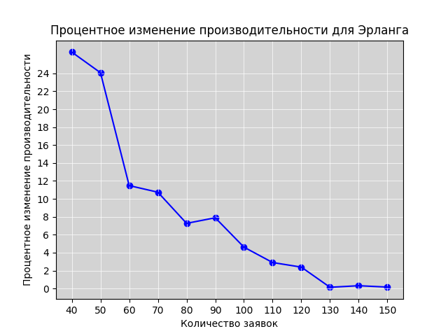

## Министерство науки и высшего образования Российской Федерации
## Федеральное государственное автономное образовательное учреждение высшего образования
## «Национальный исследовательский университет ИТМО»
## Факультет программной инженерии и компьютерной техники
**Отчёт по лабораторной работе №4**

по дисциплине
"Моделирование"

<b>Выполнили студенты группы P3312:</b>

Кобелев Роман Павлович;
Балин Артем Алексеевич;
Дениченко Александр Олегович

<b>Преподаватель:</b>
Мартынчук Илья Геннадьевич

г. Санкт-Петербург

2024г.

## Начальные условия

Кол-во узлов: 3

Количество приборов в узлах: 3, 1, 1

Номер особенного узла с ____ распределением 2

`p10` = 0.2

`p12` = 0.4

`p21` = 1

`p31` = 1

`p13` = 0.4

### Среднее время обслуживания:

`b1` = 2

`b2` = 5.5

`b3` = 10

## 4.1

### [Замкнутая модель, второй узел распределён по эрлангу](./наша%20модель%20Замкнутая%20Эрланг.gps)

Как мы видим, критическая точка достигается при $M \in [130, 150]$

### [Замкнутая модель, второй узел распределён по гиперэксп.](./наша%20модель%20Замкнутая%20Гипер.gps)

Как мы видим, критическая точка достигается при $M = 130$

### [Замкнутая модель, второй узел распределён по эрлангу](./наша%20модель%20Замкнутая%20Эрланг.gps)

done bebebe s bababa
[резы](./замкнутая_второй_узел_по_эрлангу.txt)

Итак, нам нужно было построить две модели согласно варианту, но во втором узле время обслуживания использовать в одном случае гиперэкспоненциальное, в другом - эрланга (в остальных узлах - экспоненциальное). Данный файл с эрлангом второго порядка. Менять количество заявок, чтобы достичь предела:

`GENERATE ,,,1; формирование в нулевой момент времени одну заявку`

Находите узел, в который всё упирается, пытаетесь его улучшить, изменяя t_bn, где n - номер узла (делая значение меньше, например если производительность упирается в первый узел, меняем t_b1 с 2 до 1.5 и тестим)

### [Замкнутая модель, второй узел распределён по гиперэксп.](./наша%20модель%20Замкнутая%20Гипер.gps)

done azaza
[РЕЗЫ](./замкн_гипер.txt)

Аналогично меняем заявки

Если производительность здесь упрётся в узел 2, то чтобы ускорить его, вам нужно зайти в [файл](./hyper.xlsx), изменить там b на меньшее и вписать t1 и t2 в программу

### РСеМо

done
[РЕЗЫ](./4.3.txt)

вы сделали предыдущие пункты до пункта 4.3, у вас есть данные об производительности ЗСеМо

теперь у вас есть аналогичные файлики с другим названием, где уже написан код для самой РСеМо, но вам необходимо в значение `t_a` поставить значение производительности из пред. пунктов

### для пункта 4.4 и первого подпункта

done
[РЕЗЫ](./4.4.1.txt)

>оценить влияние закона распределения (коэффициента вариации)
длительности обслуживания заявок в заданном узле на
характеристики функционирования сети

сравниваете 3 файла Замкнутых

### для 4.4 второй подпункт

>выполнить анализ влияния количества заявок в замкнутой сети с
неэкспоненциальным распределением длительности обслуживания
заявок в заданном узле на характеристики функционирования и
сравнить с аналогичными характеристиками замкнутой сети с
экспоненциальным распределением длительности обслуживания
заявок в том же узле

ключевые слова: `количества заявок`, файлики те же 3

по сути в предыдущем мы делали общие характеристики, а тут нужно прям количество заявок поисследовать, поуменьшать их и поувеличивать

### 4.5

#### Первый подпункт

сравнить разомкнутые и замкнутые, то есть эрланг с эрлангом и гипер с гипер

#### Второй подпункт

сравнить [Эрланг простейший](./наша%20модель%20Разомкнутая%20Эрланг.gps) и [Эрланг детерменированный](./Разомкнутая%20Эрланг%20ДЛЯ%204.5%20ДЕТЕРМЕНИРОВАННАЯ.gps)

и там, и там можно менять t_a, чтобы менять интенсивность входящего потока

## 5

графиков многа
