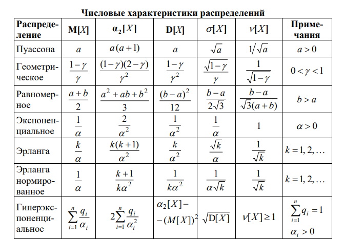

# Тесты на лекциях

1. Почему в СМО с накопителем неограниченной емкости, работающей без перегрузок, возникают очереди? В каких случаях они не возникают?

Характеристики СМО $\lambda$, $\mu$ - интенсивность потока заявок и интенсивность обслуживания, а $\rho = \frac{\lambda}{\mu}$ - коэффициент загрузки, причем $\rho < 1$ по условию. Однако очереди всё еще возникают, потому что поступление заявок в систему - случайный процесс. Даже если средняя длина очереди равна нулю, это не значит, что за момент времени $t < \frac{1}{\mu}$ нам не может прийти сразу несколько заявок. Мы даже можем найти вероятность такого события по формуле Пуассона. Если приборов меньше, чем пришедших заявок, то очередь возникнет. По формуле Пуассона можно найти ненулевую вероятность этого события для любого количества заявок. И только в случае, если количество приборов бесконечно, очередей не возникнет никогда.

2. Интенсивности поступления и обслуживания заявок в трехканальной СМО равны 24 $с^{-1}$ и 10 $с^{-1}$ соответственно. Определить среднее число работающих приборов.

Не умеем решать с многоканальными.

3. В СМО с 10-ю обслуживающими приборами поступает поток заявок с интенсивностью 8 заявок в секунду, средняя длительность обслуживания которых равна 1,25 секунд. Определить среднюю длину очереди в системе.

$\lambda = 8 c^{-1}$; $b = 1.25 c$; $N = 10$.
$$\mu = \frac{1}{b} = 0.8 c^{-1} $$
$$y = \frac{\lambda}{\mu} = 10$$
$$\rho = min(\frac{y}{N},1) = 1 \Rightarrow l \rightarrow \infty$$

4. Длительность обслуживания заявок в одном приборе четырехканальной
СМО с накопителем неограниченной емкости равна 4 минуты. Определить предельно допустимую интенсивность поступления заявок в систему.

Не решаемо (пока).

5. Какое распределение длительности обслуживания заявок в СМО является предпочтительным для уменьшения среднего времени ожидания заявок?

Т.к. среднее время ожидания заявок будет $$ \frac{\lambda b^2(1+\mathit{v^2_b})}{2(1-\rho)}$$
то наименьшее время ожидания будет при наименьшем значении $\mathit{v^2_b}$, например, при детерменированном распределении $\mathit{v_b} = 0$. Если недетерменированное, то см. табличку:

6. Заявки поступают в десятиканальную СМО с интенсивностью 5 заявок в секунду, интенсивность обслуживания - 1 заявка в секунду, средняя длина очереди заявок в системе - 20. Определить:
    - загрузку системы;
    - среднее время пребывания заявки в системе;
    - среднее число параллельно работающих приборов.

Нерешеаемо (пока).
